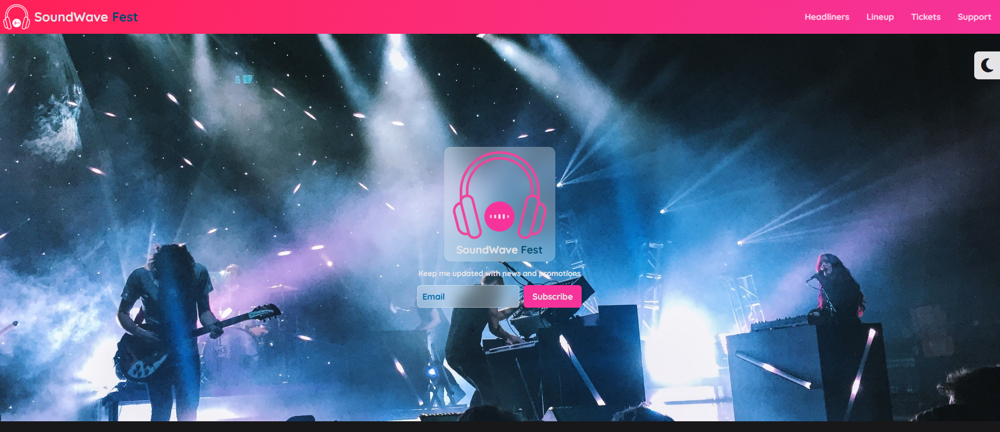
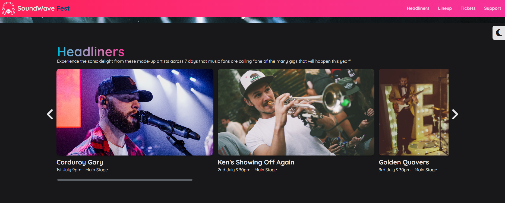
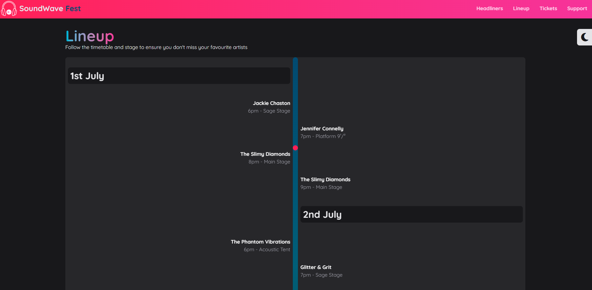
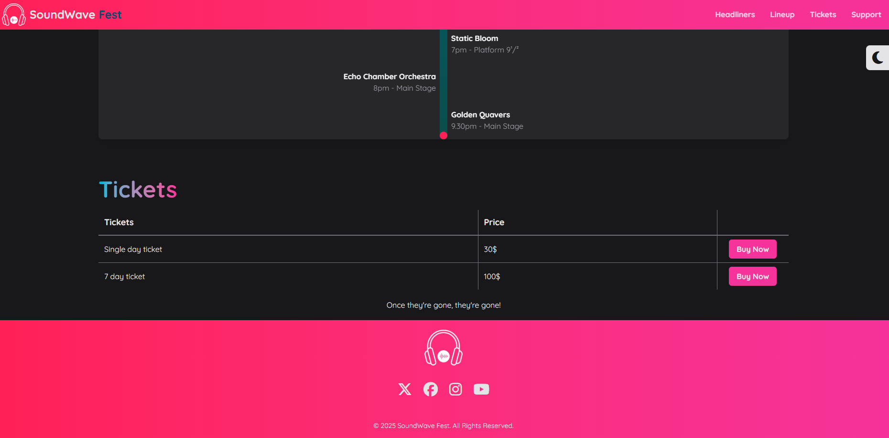

# 🎶 SoundWave Fest  


---

**SoundWave Fest** is a modern festival website that allows users to explore the performing artists of the event.  
The **Headliners** section highlights the main stage artists, while the **Lineup** section displays daily performances with their stages and time slots.  
At the bottom, a **Ticket** section provides an option to purchase festival tickets.  

---

## 🚀 Features  

- 📱 **Responsive Design** – Works seamlessly on all devices  
- 🌙 **Dark Mode** – Eye-friendly theme option  
- ✨ **Animations** – Smooth transitions and interactive effects  
- 🎤 **Lineup & Headliners** – Easy navigation of festival schedule  
- 🎟️ **Ticket Section** – Quick and simple ticket purchase  

---

## 🛠️ Tech Stack  

<div align="left">
  
</div>

---
## 📸 Preview  

<p align="center">
  
  <br/>
  
  <br/>

<br/>

</p>

## 📦 Installation  

```bash
# Clone the repository
git clone https://github.com/zopirli-berke/soundwave-fest.git

# Navigate into the project directory
cd soundwave-fest

# Build the project
npm run build

